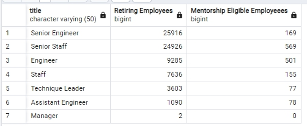

# Pewlett-Hackard-Analysis
## Overview
The purpose of this analysis was to identify how many employees are retiring per title and who are eligible to participate in mentorship program.

## Results
* Full list of retiring employees (133,776 rows) have been identified, but with duplicates due to varying positions held by one person as well as employees who have already left the company.


* Final list of retiring emoployees (72,458 rows, or employees) have been identified, who are still with the company.


* Total number of retiring employees are displayed per title, with 25,916 senior engineers at the highest number and 2 managers at the lowest nunber.


* Current employees eligible to participate in mentorship (born in the year 1965) have been identified, totaling 1,549 employees.


## Summary
25,916 roles will need to be filled as "silver tsunami" begins to take affect. Below is the specific number of roles that needs to be filled per position:


Running below code block illustrates and helps to compare the number of employees retiring versus mentorship eligible employees by the title. As shown in the table, there are far greater number of employees retiring than there are eligible to provide mentorship. The disparity is at greatest in senior engineer level, which means engineers will be hardest to replace once the "silver tsunami" storms in. Since there aren't many employees to provide mentorship to cover the loss of retiring employees, it may be a option to expand the eligibility requirement on mentorship to minimize the loss of manpower and knowledge in the coming years. 

```
SELECT rt.title, rt.count AS "Retiring Employees", count(me.emp_no) AS "Mentorship Eligible Employeees"
FROM retiring_titles AS rt
LEFT JOIN mentorship_eligibility AS me
ON rt.title = me.title
GROUP BY rt.title, rt.count
ORDER BY rt.count DESC
```

